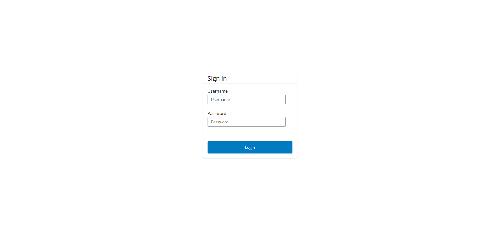
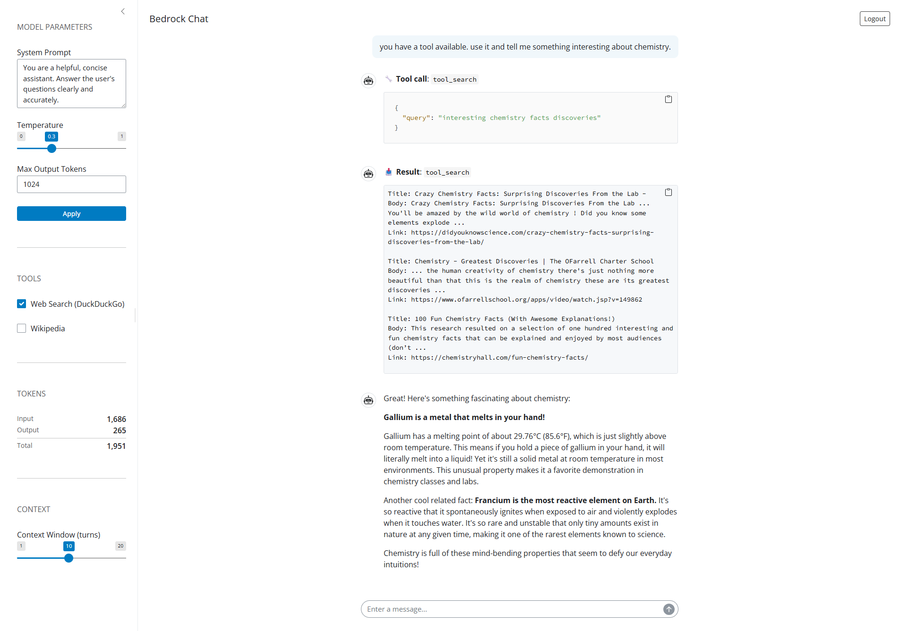

# bedrock-chat

A Shiny for Python app with user authentication and a streaming chat UI powered by LangChain and AWS Bedrock (Anthropic Claude).

## Project structure

```
bedrock-chat/
├── app.py               # Entry point
├── llm.py               # LLM factory (ChatBedrockConverse singleton)
├── modules/
│   ├── __init__.py
│   ├── login.py         # Login module - UI + server
│   └── chat.py          # Chat module - UI + server
├── .env                 # Local secrets (not committed)
├── .env.example         # Environment variable template
└── requirements.txt
```

## Setup

### 1. Clone and create a virtual environment

```bash
git clone https://github.com/ewmcc/bedrock-chat.git
cd bedrock-chat
python -m venv .venv
.venv\Scripts\activate

```

### 2. Install dependencies

```bash
pip install -r requirements.txt
```

### 3. Configure environment variables

```bash
cp .env.example .env
```

Edit `.env` and set:

| Variable | Description |
|---|---|
| `APP_USERNAME` | Login username |
| `APP_PASSWORD` | Login password |
| `AWS_ACCESS_KEY_ID` | AWS access key |
| `AWS_SECRET_ACCESS_KEY` | AWS secret key |
| `AWS_REGION` | AWS region (default: `us-east-1`) |
| `BEDROCK_MODEL_ID` | Bedrock model ID |

### 4. Run the app

```bash
shiny run app.py
```

Then open [http://localhost:8000](http://localhost:8000) in your browser.

## Screenshots

### Login Page


### Example Tool Call/Response

